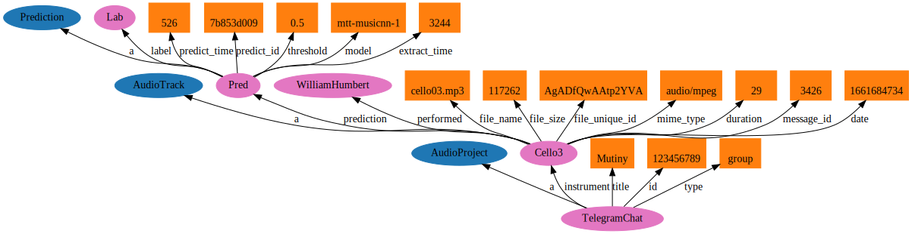

# b8b_virtuoso

This repository is part of the Beat Byte Bot Ecosystem (B8B).

- B8B Result Analysis: https://github.com/gilpanal/b8b_result_analysis
- B8B Virtuoso: https://github.com/gilpanal/b8b_virtuoso
- B8B Synapse: https://github.com/gilpanal/b8b_synapse


## Requirements:
- Node.js (v16)
- Telegram Bot Token: https://core.telegram.org/bots#6-botfather
- Virtuoso Universal Server (https://shop.openlinksw.com/onboarding/) or Virtuoso Docker: https://hub.docker.com/r/tenforce/virtuoso
- B8B Synapse: https://github.com/gilpanal/b8b_synapse/#how-to-run-and-test-it-locally (Mandatory)
- B8B Result Analysis: https://github.com/gilpanal/b8b_result_analysis#how-to-run-it-locally. (Optional: see Note 1)

## How to run and test it locally:
1. ```git clone https://github.com/gilpanal/b8b_virtuoso.git```
2. ```cd b8b_virtuoso```
3. ```npm i```
4. Rename `config/env_vars_template.js` to `config/env_vars.js` and include the Bot Token
5. Start the main server by typing ```npm start```
6. In Telegram, create a new group
2. Add the bot you created (via BotFather) as an admin to the chat
3. Attach an audio file (MP3 or WAV) less than 20 MB size


#### NOTES:

1.- If you want to avoid running B8B Result Analysis to validate results just comment line ```await storeResultsExperiment1(message.audio,predictionInfo)``` at `virtuoso_helper.js`

2.- By default it's assumed that Virtuoso instance is running at `http://127.0.0.1:8890/sparql`. You can point a different host changing the address at `bot.js`

3.- In `config/env_vars.js` file there's a variable named MODE that is meant for deploying to different environments, PROD, STAGE or DEV. For local development is enough with the following configuration:

>       const MODE = 'DEV' // DEV, STAGE, PROD
>       const ENVIRONMENTS = {
>           DEV : {
>               TELEGRAM_TOKEN: '<BOT_TOKEN>',
>               DATABASE_URL: ''
>           },

4.- Two different ontologies are included in the folder `ontology`. One is generated via Protégé, entitled `beat_byte_bot.owl`and the other, `b8bontology.ttl`, is meant to be used with the project Ontology Visualization: https://github.com/usc-isi-i2/ontology-visualization/issues/18. More info: https://www.w3.org/2018/09/rdf-data-viz/




## Some SPARQL queries:

Default Data Set Name (Graph IRI):
http://beatbytebot.web.app/resource/

Query Text:
`PREFIX b8b:  <http://beatbytebot.web.app/ontology/>`

...


##### A. Get all items in the graph
```
SELECT * WHERE { ?s ?p ?o . }

```

##### B. Get the objects from all existing s-p-o triples
```
SELECT DISTINCT ?o WHERE { ?s ?p ?o . }

```

##### C. Get all classes being used
```

SELECT DISTINCT ?class WHERE {[] a ?class} 

```

##### D. Get all AudioProjects
```
SELECT DISTINCT ?audioprojects WHERE  {?audioprojects rdf:type <http://beatbytebot.web.app/ontology/AudioProject>.}

```

##### E. Get all AudioTracks
```
SELECT DISTINCT ?audiotracks WHERE {?audiotracks rdf:type <http://beatbytebot.web.app/ontology/AudioTrack>.}

```

##### F. Get all props from a class
```
SELECT DISTINCT ?property ?object WHERE {<http://beatbytebot.web.app/ontology/##ID##> ?property ?object.}

```

